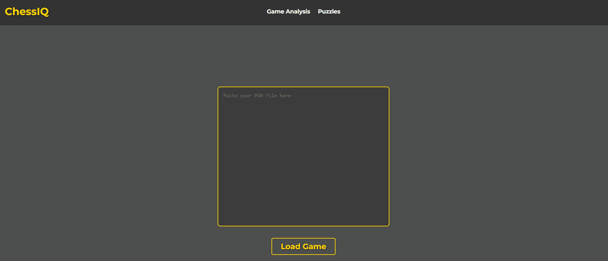

# ChessIQ ♟️

An AI-powered chess analysis platform that integrates the **Stockfish engine** with a **Large Language Model (LLM)** to provide human-readable move explanations, error classification, and instant feedback.  

---

## ✨ Features
- 🔍 **PGN Analysis**: Upload chess games in PGN format for full move-by-move evaluation.  
- ♟️ **Stockfish Integration**: Uses Stockfish at depth 16 for accurate centipawn evaluations.  
- ⚠️ **Error Classification**: Detects inaccuracies, mistakes, and blunders based on centipawn thresholds:
  - Inaccuracy: ≥30 cp
  - Mistake: ≥50 cp
  - Blunder: ≥150 cp
- 🤖 **LLM Integration**: Translates raw engine evaluations into **human-readable explanations**.  
- ⚡ **Real-time Feedback**: Web interface streams instant evaluations and annotated errors.  

---

## 🛠️ Tech Stack
- **Backend**: Python (Flask), Stockfish engine, `python-chess` library  
- **Frontend**: React (for interactive board & real-time visualization)  
- **AI/ML**: GroqCloud API with LLaMA LLM integration  
- **Other Tools**: tqdm, Flask-CORS

---

## 🚀 Getting Started

### Prerequisites
- Python 3.9+
- Stockfish installed ([download here](https://stockfishchess.org/download/))  
  ➝ Update the `stockfish_path` variable in `server.py` with the path to your local Stockfish binary.

### Install dependencies
Clone the repo and install Python packages:
```bash
pip install -r requirements.txt
```
### Run 
`python server.py `

---

### 📊 Key Metrics

- Analyzed 50+ PGN games with average 95% accuracy compared to master annotations.

- Delivered annotated feedback in <1s per move.

- Classified 3+ types of mistakes (inaccuracy, mistake, blunder) automatically.

- Processed full PGN games of up to 80+ moves seamlessly.

--- 
### 🎥 Live Demo


👥 Author
- Yann Yvan Toukam Djomo

